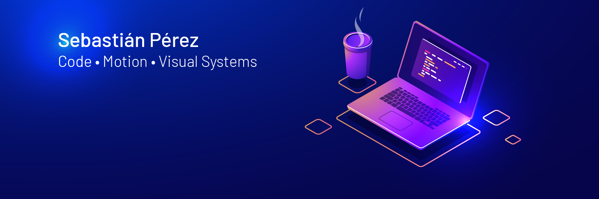

<h1> Bienvenido a mi Github </h1>

Working with React, JavaScript, Python and Flask.
Background in motion graphics, 3D animation and audiovisual post-production, with experience creating visual content for television and digital media.

Currently interested in building web applications, creative tools and visual platforms, combining software development with visual design and motion.
.

<!--
**Sebaperez12/Sebaperez12** is a ✨ _special_ ✨ repository because its `README.md` (this file) appears on your GitHub profile.

Here are some ideas to get you started:

- 🔭 I’m currently working on ...
- 🌱 I’m currently learning ...
- 👯 I’m looking to collaborate on ...
- 🤔 I’m looking for help with ...
- 💬 Ask me about ...
- 📫 How to reach me: ...
- 😄 Pronouns: ...
- ⚡ Fun fact: ...
-->
 
